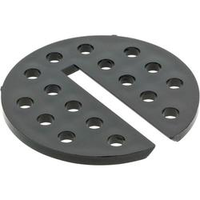

# Grizzly G0640X Bandsaw Throat Plate

The [Grizzly G0640X Bandsaw](http://www.grizzly.com/products/17-Metal-Wood-Bandsaw-w-Inverter-Motor/G0640X) 
comes with a throat plate that's a little soft, and has holes to allow an
attached vacuum to suck up shavings. Since we don't have a vacuum attached to
ours, we don't need all the holes, and would prefer a narrower slot, to keep
small bits from falling into the machine.

[OEM throat plate](http://www.grizzly.com/products/Table-Insert-for-G0555X-G0457-G0513-Series-G0514-Series-and-G0640X/T24384):

The model is parameterized so you can adjust it to meet your needs.
I've created several parts for you:

* [original](bandsaw-throat-plate-original.stl)  
  This is a throat plate the same size as the OEM, but without holes (8x16).

* [optimum](bandsaw-throat-plate-optimum.stl)  
  This is a throat plate with a narrower, shorter slot (5x18).

* [assortment](bandsaw-throat-plate-assortment.stl)  
  This is an assortment of throat plates with a variety of slot sizes.
  This is sized to print on the Prusa Mk2/Mk3.
